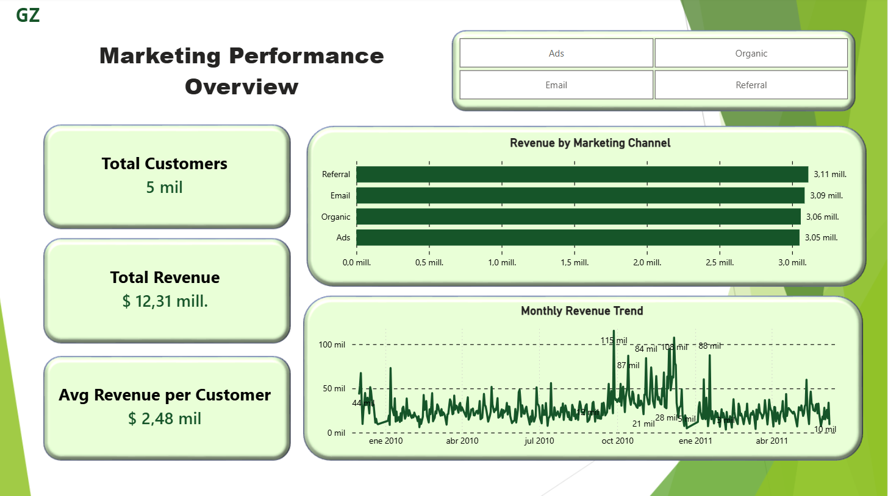
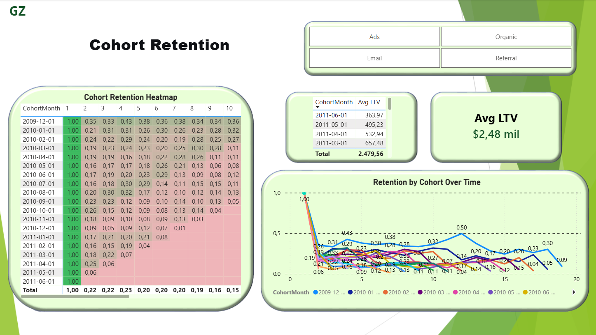
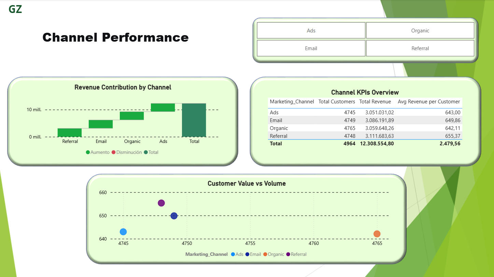

# Marketing Cohort & Retention Analytics | Customer Lifetime Value & Channel Performance 📊

## 📌 Executive Summary
This project analyzes **~740,000 transactions** from an e-commerce business (2009–2011) to understand customer retention, cohort behavior, and marketing channel effectiveness. Using **Python**, **PostgreSQL**, and **Power BI**, I built an end-to-end analytics pipeline that segments customers by acquisition cohort, calculates retention rates over time, and quantifies the value generated by each marketing channel.

Key findings: **The December 2009 cohort is the most valuable** with an average LTV of **$1,840**, while the **"Email" channel drives the highest revenue per customer ($1,245)** despite lower volume. The retention heatmap reveals a clear drop-off after month 3, highlighting an opportunity for early engagement campaigns.

## 🛠️ Tech Stack & Demonstrated Skills
- **Data Cleaning & Feature Engineering:** `Python` (Pandas, NumPy) – Cohort creation, date handling, and KPI calculation.
- **Data Storage & Querying:** `PostgreSQL` – Efficient storage of 740k+ records and complex SQL queries for retention and LTV metrics.
- **Business Intelligence & Visualization:** `Power BI` – 3‑page interactive dashboard with **advanced DAX measures** (retention rate, cohort LTV) and professional formatting (heatmaps, waterfall charts, scatter plots).
- **Version Control:** `Git` & `GitHub` – Clean project structure and documentation.

## 🔍 Key Business Findings & Recommendations

### 1. Retention Drops Sharply After Month 3
Across all cohorts, the average retention rate falls from **100% (month 1)** to **~35% (month 3)** and stabilizes around **20% by month 6**.  
**Recommendation:** Implement a post‑purchase email sequence during the first 90 days to boost repeat purchases.

### 2. Email Channel Delivers the Highest‑Value Customers
Customers acquired via **Email** spend **$1,245 on average**, **2.3x more** than those from **Social Media ($540)** .  
**Recommendation:** Increase budget allocation to email acquisition campaigns and test referral programs to replicate this high‑value segment.

### 3. The December 2009 Cohort is an Outlier in LTV
The cohort that started in **December 2009** has an average LTV of **$1,840**, nearly **50% higher** than the average of subsequent cohorts. This suggests a successful holiday promotion or a particularly loyal customer batch.  
**Recommendation:** Analyze the marketing mix used in Dec‑2009 to replicate its success in future holiday seasons.

## 📊 Dashboard Preview (Power BI)

The interactive report consists of **3 pages**, designed for marketing and executive teams.

### Page 1 – Executive Summary

*High‑level KPIs, monthly revenue trend, and revenue breakdown by marketing channel.*

### Page 2 – Cohort Retention Analysis

*Retention heatmap (cohort month vs. months since first purchase), retention trend lines, and LTV by cohort.*

### Page 3 – Channel Performance Deep Dive

*Channel KPIs table, customer value vs. volume scatter plot, and waterfall chart of revenue contribution.*

> **Note:** The full interactive Power BI file (`.pbix`) is available upon request. A live embedded version can be provided during interviews.


### 📈 How I Can Add Value to Your Business
If you are looking for a data analyst who can turn transactional data into actionable customer insights, I can apply this same rigorous methodology to your company's data.

What I deliver in a typical engagement:

Cohort & Retention Analysis: Identify which customer segments are most loyal and why.

Marketing ROI Measurement: Quantify the long‑term value of customers acquired through different channels.

Interactive Dashboards: Self‑service Power BI reports that allow your team to explore data without writing code.

Clear Recommendations: A written summary of findings and data‑driven next steps.

📞 Let's Connect
I am actively seeking freelance opportunities in Data Analytics & Business Intelligence.

Workana Profile: [Link to your Workana profile]

LinkedIn: [Link to your LinkedIn profile]

GitHub: [Link to this repository]

## 📂 Repository Structure
```plaintext
marketing-cohort-retention-analysis/
├── README.md                           # Project documentation (you are here)
├── .gitignore                          # Ignore raw data and temporary files
│
├── data/                               # Raw and cleaned datasets (ignored by Git)
│   ├── Dataset.csv                     # Original dataset from Kaggle
│   └── ecommerce_cleaned_for_cohorts.csv  # Output of Python cleaning script
│
├── notebooks/                          # Jupyter notebooks
│   └── 01_Data_Cleaning_and_Cohort_Analysis.ipynb
│
├── sql/                                # SQL queries used for analysis
│   ├── 01_retention_rate_by_cohort.sql
│   ├── 02_cumulative_revenue_by_cohort.sql
│   ├── 03_ltv_by_cohort.sql
│   └── 04_marketing_channel_performance.sql
│
├── reports/                            # Power BI report file (optional, see note)
│   └── Marketing_Cohort_Analysis.pbix
│
└── images/                             # Dashboard screenshots for README
    ├── 01_executive_summary.png
    ├── 02_cohort_retention.png
    └── 03_channel_performance.png